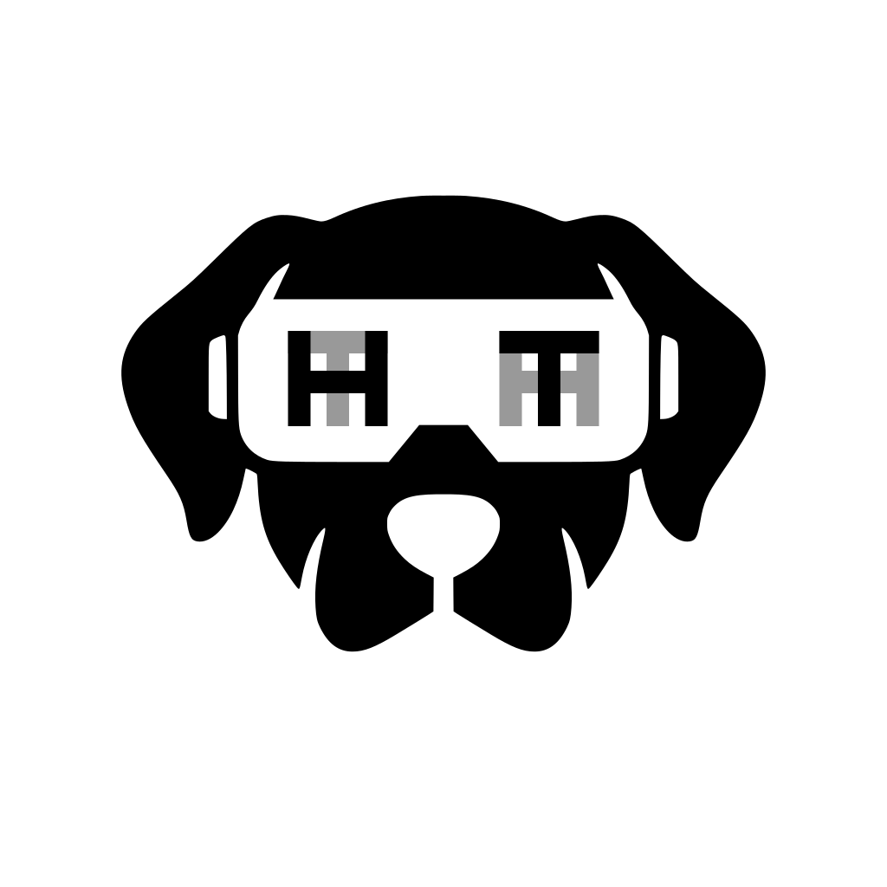

# Heiervang Technologies visor logo

Owner-approved design, 2026-09-06: dog silhouette with overlapping H/T
monograms in the visor. H is foreground on the left, T foreground on the right;
the opposite glyph is gray behind each one. The glyph pairs share their bounds.

- [Vector master](ht-visor.svg): transparent background, outlined glyphs; no fonts needed.
- [1024px PNG](ht-visor.png): transparent background.
- The dog retains its original proportions. Glyphs are 25% wider than C2,
  with the original 13-unit stroke thickness and symmetric centers preserved.
- Colors: foreground `#000000`, rear glyphs `#999999`.

The canonical assets live in [the assets repository](https://github.com/heiervang-technologies/assets/tree/main/brand/heiervang-technologies).
Admin keeps an identical copy for organizational reference. Keep the two copies
in sync when an owner-approved revision replaces this master.

Derived from the existing Bonfire dog SVG; this company-logo variant is managed
separately from the Kindle project. Color experiments are not approved replacements.
